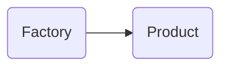

# 创建型模式

创建型模式提供了创建对象的机制， 能够提升已有代码的灵活性和可复用性。

创建对象这一简单的动作能有什么花活呢？

## 工厂模式

### 简单工厂


实现逻辑在 Factory 内

如 ``java.text.DateFormat`` 中静态的 ``get`` 方法就是一个简单工厂的应用

```java
public abstract class DateFormat extends Format {
    //...
    private static DateFormat get(int timeStyle, int dateStyle, int flags, Locale loc) {
        //...
    }

    private static DateFormat get(LocaleProviderAdapter adapter, int timeStyle, int dateStyle, Locale loc) {
        //...
    }
}
```

### 工厂方法


### 抽象工厂